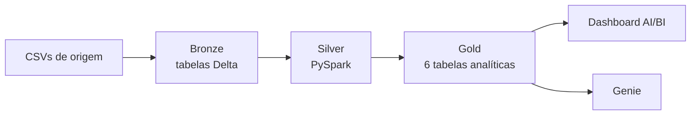

<h1 align="center">Olá! Eu sou a Jéssica Fuentes 👩‍💻</h1>

<h3 align="center">
  Analista de Dados (Data Analyst) | Business Intelligence | SQL · Power BI · Python · Databricksssssss
</h3>

  📍 São Paulo, Brasil &nbsp;|&nbsp; 💼 Aberta a oportunidades como Analista de Dados, Analista de BI e Data Engineer

  
  

---

## 👩‍💻 Sobre mim

Transformo dados operacionais em indicadores, dashboards e automações que reduzem custos e aceleram processos.

Sou graduada em **Análise e Desenvolvimento de Sistemas**, com **18 anos de experiência** em Comércio Exterior, Logística e Operações em empresas multinacionais, e atuação prática em análise de dados, BI e automação. Combino visão de negócio e tecnologia com **SQL, Power BI, Excel, Power Query, DAX e Python**.

Em paralelo, desenvolvo projetos de **Engenharia de Dados em Databricks** (arquitetura Medallion, PySpark e Delta Lake). Este espaço reúne meus projetos práticos de Dados e BI.

---

## 🎯 Resultados na prática (experiência profissional)

| Resultado | Como |
|---|---|
| 📊 **-50%** nos dias médios de permanência de contêineres no terminal | Dashboard em Power BI de free time, custos e prazos |
| 💰 **~R$ 250 mil/ano** em custos evitados | Controle de vencimentos em Excel com alertas |
| ⚡ **3 a 5 dias** a menos no ciclo médio de importação | Acompanhamento automatizado, da chegada à nacionalização |
| 🚚 **-20%** no frete nacional | Análise de custos por rota e transportadora (SQL, CRM e Excel) |

---

## ⭐ Projeto em destaque: E-commerce Lakehouse

Plataforma de dados ponta a ponta em **Databricks**, com arquitetura **Medallion**, orquestração com Jobs, testes automatizados e dashboard AI/BI com Genie.

- **Bronze:** ingestão parametrizada de 4 arquivos CSV
- **Silver:** limpeza, padronização, deduplicação e regras de negócio
- **Gold:** vendas por período, métricas de produtos, segmentação de clientes (VIP/TOP_TIER/REGULAR), análise de preços da concorrência e monitoramento de qualidade de dados
- **Engenharia:** Databricks Jobs, Asset Bundles (IaC), Unity Catalog e testes de schema e regras de negócio

👉 [Ver o projeto](https://github.com/Jessica-Fuentess/Projeto_Ecommerce_Databricks)

---

## 📂 Outros projetos

| Projeto | O que mostra | Tecnologias |
|---|---|---|
| [Dashboard Financeiro](https://github.com/Jessica-Fuentess/Financial_Dashboard) | Receitas, custos, impostos, margem e lucro | Power BI · DAX · Power Query |
| [Dashboard de RH](https://github.com/Jessica-Fuentess/HR_Dashboard) | Headcount, turnover, folha e horas extras | Power BI · DAX · Power Query |
| [Dashboard de Produção](https://github.com/Jessica-Fuentess/Production_Dashboard) | Qualidade, disponibilidade e produtividade | Power BI · DAX · Power Query |
| [Dashboard de Vendas](https://github.com/Jessica-Fuentess/Sales_Dashboard) | Receita por período, marca e continente | Power BI · Power Query |
| [Análise em SQL](https://github.com/Jessica-Fuentess/SQL_Data_Analysis) | Modelagem relacional, JOINs, subqueries e views | MySQL · SQL Server |
| [Análise de Churn](https://github.com/Jessica-Fuentess/Data_Analytics_Python) | Fatores de cancelamento de clientes | Python · Pandas · Plotly |
| [Score de Crédito](https://github.com/Jessica-Fuentess/Credit_Score_Classification) | Classificação com Random Forest e KNN | Python · Scikit-learn |
| [Automação de Cadastro](https://github.com/Jessica-Fuentess/Process_Automation_Python) | Cadastro de produtos automatizado a partir de CSV | Python · Pandas · PyAutoGUI |
| [Chatbot com IA](https://github.com/Jessica-Fuentess/AI_Chatbot_Python) | Chat com contexto e engenharia de prompts | Python · Streamlit · OpenAI API |

Também tenho projetos front-end (HTML, CSS e JavaScript): [Site-Barbearia](https://github.com/Jessica-Fuentess/Site-Barbearia), [Previsao-do-tempo](https://github.com/Jessica-Fuentess/Previsao-do-tempo), [Site-android](https://github.com/Jessica-Fuentess/Site-android) e [Projeto-Login](https://github.com/Jessica-Fuentess/Projeto-Login).

---

## 🛠 Tech Stack

**📊 Dados e BI**

**🏗 Engenharia de Dados**

**🐍 Python e Machine Learning**

**💻 Desenvolvimento**

**⚙ Ferramentas e sistemas**

---

## 📚 Estudando atualmente

---

## 📬 Vamos conversar?

Aberta a oportunidades como **Analista de Dados**, **Analista de BI** e **Data Engineer**.

- 👔 [LinkedIn](https://www.linkedin.com/in/j%C3%A9ssica-fuentes/)
- 📩 [fuentesbr@gmail.com](mailto:fuentesbr@gmail.com)

  ✨ <i>"Transformando dados em decisões inteligentes e resultados para o negócio."</i> ✨

